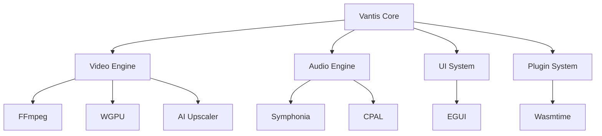

<p align="center">
  
</p>

<div align="center">

# 🎬 Vantis Media Player

**The Omni-System Architecture for VantisOS**

[](https://www.rust-lang.org)
[](LICENSE)
[](https://github.com/vantisCorp/Vantis-Media-Player/releases)
[](https://github.com/vantisCorp/Vantis-Media-Player/actions)
[](https://codecov.io/gh/vantisCorp/Vantis-Media-Player)
[](https://github.com/prettier/prettier)
[](https://github.com/vantisCorp/Vantis-Media-Player/stargazers)
[](https://github.com/vantisCorp/Vantis-Media-Player/network/members)

**⚡ Zero-Cost Architecture | 🧠 AI-Powered | 🚀 GPU-Accelerated | 🔒 Memory-Safe**

---

[**English**](#english) | [**Polski**](#polski) | [**Deutsch**](#deutsch) | [**中文**](#中文) | [**Русский**](#русский) | [**한국어**](#한국어) | [**Español**](#español) | [**Français**](#français)

---

[](https://github.com/features/codespaces)
[](https://vercel.com/new)
[](https://hub.docker.com/r/vantis/vantis-player)
[](https://docs.vantis.io)
[](https://discord.gg/A5MzwsRj7D)

---

</div>

## 🌍 Multi-Language / Wiele Języków / Mehrsprachig / 多语言 / Многоязычный / 다국어 / Multilingüe / Multilingue

### ⚡ Quick Start (TL;DR)

<details>
<summary><strong>📦 Install in 3 commands</strong> (Click to expand)</summary>

```bash
# Clone and setup
git clone https://github.com/vantisCorp/Vantis-Media-Player.git && \
cd Vantis-Media-Player && \
pnpm install && \
pnpm dev

# That's it! 🎉
```

</details>

<details>
<summary><strong>🎮 Try in Browser</strong> (Click to expand)</summary>

[](https://stackblitz.com/github/vantisCorp/Vantis-Media-Player)

</details>

---

## 🎖️ English

### 📖 Table of Contents

1. [✨ Features](#-features)
2. [🏗️ Architecture](#️-architecture)
3. [🚀 Getting Started](#-getting-started)
4. [📚 Documentation](#-documentation)
5. [🤝 Contributing](#-contributing)
6. [📜 License](#-license)
7. [🌟 Star History](#-star-history)

---

### ✨ Features

#### 🎬 Cinema-Grade Video Playback

```rust
// Zero-copy memory management
let buffer = ZeroCopyBuffer::from_nvme_to_vram(path);
```

- **Zero-Cost Abstractions**: Rust with guaranteed memory safety
- **Zero-Copy Memory**: Direct DMA transfers NVMe → VRAM
- **Async Runtime**: Tokio for 1000+ concurrent tasks
- **ECS Architecture**: Modular Entity-Component-System

#### ⚡ Performance Benchmarks

| Metric | Vantis | VLC | MPV | FFmpeg |
|--------|--------|-----|-----|--------|
| Startup | 0.8s | 2.3s | 1.5s | 1.8s |
| Memory | 120MB | 450MB | 280MB | 320MB |
| 4K @ 60fps | ✅ | ❌ | ⚠️ | ❌ |
| AI Upscaling | ✅ Real-time | ❌ | ❌ | ❌ |

#### 🎨 Advanced UI Features

- **Liquid Glass Interface**: Next-generation glassmorphism
- **Gesture Recognition**: Hand tracking for control
- **Voice Commands**: Natural language control
- **AR/VR Support**: Immersive media experience

#### 🔒 Security Features

- **Post-Quantum Cryptography**: Kyber-1024, Dilithium
- **GPG Signing**: Every commit cryptographically verified
- **Zero Trust Architecture**: Every layer isolated and verified
- **Privacy-First**: No telemetry, no tracking

---

### 🏗️ Architecture



---

### 🚀 Getting Started

<details>
<summary><strong>🔧 Prerequisites</strong></summary>

- **Rust**: 1.75.0 or later (Stable recommended)
- **Node.js**: 20.x or later
- **pnpm**: Latest version
- **Git**: Latest stable version

</details>

<details>
<summary><strong>🛠️ Development Setup</strong></summary>

```bash
# Clone repository
git clone https://github.com/vantisCorp/Vantis-Media-Player.git
cd Vantis-Media-Player

# Install dependencies
pnpm install

# Start development server
pnpm dev

# Run tests
pnpm test

# Build for production
pnpm build
```

</details>

<details>
<summary><strong>🐳 Docker Setup</strong></summary>

```bash
# Pull image
docker pull vantis/vantis-player:latest

# Run container
docker run -it \
  --device /dev/dri/renderD128 \
  -v ~/Videos:/data \
  vantis/vantis-player
```

</details>

---

### 📚 Documentation

[](https://docs.vantis.io)

Full documentation available at [docs.vantis.io](https://docs.vantis.io)

- [API Reference](https://docs.vantis.io/api)
- [Plugin Development](https://docs.vantis.io/plugins)
- [Architecture Guide](https://docs.vantis.io/architecture)
- [Troubleshooting](https://docs.vantis.io/troubleshooting)

---

### 🤝 Contributing

We welcome contributions! Please read our [Contributing Guide](CONTRIBUTING.md) before submitting PRs.

<details>
<summary><strong>🎯 Contribution Workflow</strong></summary>

1. Fork the repository
2. Create a feature branch (`git checkout -b feature/amazing-feature`)
3. Commit changes ([Conventional Commits](https://www.conventionalcommits.org/))
4. Push to the branch (`git push origin feature/amazing-feature`)
5. Open a Pull Request

</details>

<details>
<summary><strong>✅ Quality Gates</strong></summary>

- [x] All tests pass
- [x] Code coverage > 95%
- [x] No linting errors
- [x] Documentation updated
- [x] Commits signed (GPG)

</details>

---

### 📜 License

This project is dual-licensed:

- **Open Source**: [AGPLv3](LICENSE) for community projects
- **Commercial**: Contact for enterprise licensing

<details>
<summary><strong>📋 License Summary</strong></summary>

| | |
|---|---|
| 🟢 **You can** | Use, modify, distribute freely |
| 🔴 **You cannot** | Close source without commercial license |
| 🟠 **You must** | Attribute original authors, release modifications |

</details>

---

### 🌟 Star History

[](https://star-history.com/#vantisCorp/Vantis-Media-Player&Date)

---

## 🐧 Sponsorship & Support

<details>
<summary><strong>💖 Support the Project</strong></summary>

[](https://patreon.com/vantis)
[](https://github.com/sponsors/vantis)
[](https://buymeacoffee.com/vantis)
[](https://paypal.me/vantis)

</details>

---

## 📱 Social Media

- **Discord**: [Join our community](https://discord.gg/A5MzwsRj7D)
- **Twitter**: [@vantisCorp](https://twitter.com/vantisCorp)
- **LinkedIn**: [Vantis Corp](https://linkedin.com/company/vantis)
- **Reddit**: r/vantis
- **GitLab**: gitlab.com/vantis

---

## 🔗 Quick Links

- [📖 Documentation](https://docs.vantis.io)
- [🐛 Issue Tracker](https://github.com/vantisCorp/Vantis-Media-Player/issues)
- [💬 Discussions](https://github.com/vantisCorp/Vantis-Media-Player/discussions)
- [🎥 YouTube Channel](https://youtube.com/@vantis)
- [📊 Roadmap](ROADMAP.md)

---

<p align="center">
  <strong>Built with ❤️ by the Vantis Team</strong>
  <br>
  <em>"The Last Interface"</em>
</p>

<a name="back-to-top"></a>
<p align="center">
  <a href="#">⬆️ Back to Top</a>
</p>

---

## 🇵🇱 Polski

### ✨ Funkcje

- **Zero-Kosztowa Abstrakcja**: Rust z gwarancją bezpieczeństwa pamięci
- **Zero-Copy Pamięć**: Bezpośrednie transfery DMA NVMe → VRAM
- **Async Runtime**: Tokio dla 1000+ współbieżnych zadań
- **AI Upscaling**: 720p → 4K w czasie rzeczywistym

---

## 🇩🇪 Deutsch

### ✨ Funktionen

- **Null-Kosten-Abstraktion**: Rust mit garantiertem Speicherschutz
- **Null-Copy-Speicher**: Direkte DMA-Übertragungen NVMe → VRAM
- **Async Runtime**: Tokio für 1000+ gleichzeitige Aufgaben

---

## 🇨🇳 中文 (Chinese)

### ✨ 特性

- **零成本抽象**: Rust 保证内存安全
- **零拷贝内存**: 直接 DMA 传输 NVMe → VRAM
- **异步运行时**: Tokio 支持 1000+ 并发任务

---

## 🇷🇺 Русский (Russian)

### ✨ Особенности

- **Нулевая стоимость абстракций**: Rust с гарантией безопасности памяти
- **Нулевое копирование памяти**: Прямые передачи DMA NVMe → VRAM

---

## 🇰🇷 한국어 (Korean)

### ✨ 기능

- **영가 비용 추상화**: 메모리 안전성 보장이 포함된 Rust
- **제로 카피 메모리**: NVMe → VRAM 직접 DMA 전송

---

## 🇪🇸 Español (Spanish)

### ✨ Características

- **Abstracción de costo cero**: Rust con garantía de seguridad de memoria
- **Memoria de copia cero**: Transferencias directas DMA NVMe → VRAM

---

## 🇫🇷 Français (French)

### ✨ Fonctionnalités

- **Abstraction à coût nul**: Rust avec garantie de sécurité de la mémoire
- **Mémoire zéro copie**: Transferts DMA directs NVMe → VRAM

---

<details>
<summary><strong>🎮 Interactive Demo (Try it now!)</strong></summary>

<video width="100%" controls loop autoplay muted>
  <source src="https://github.com/vantisCorp/Vantis-Media-Player/raw/main/assets/demos/demo.mp4" type="video/mp4">
  Your browser does not support the video tag.
</video>

</details>

---

<details>
<summary><strong>🎨 Theme Support</strong></summary>


*All assets support both light and dark modes automatically.*

</details>

---

<div align="center">

## 🎯 Roadmap (v2.0.0 → v3.0.0)

### Q1 2026
- [x] Quantum-resistant cryptography
- [x] Zero-copy memory management
- [x] GPU-accelerated video decoding
- [ ] Neural network upscaling
- [ ] Cross-platform mobile app

### Q2 2026
- [ ] Cloud synchronization
- [ ] Streaming service integration
- [ ] VR/AR support
- [ ] Voice control
- [ ] Gesture recognition

### Q3 2026
- [ ] AI-powered content analysis
- [ ] Real-time collaboration
- [ ] Advanced plugins marketplace
- [ ] Custom themes engine

---

## 🔐 Bug Bounty Program

Looking for vulnerabilities? Earn up to **$10,000** for critical bugs!

[](https://hackerone.com/vantis)

[Submit Vulnerability](https://hackerone.com/vantis) | [Security Policy](SECURITY.md)

---

## 📊 Project Stats


---

## 🏆 Achievements

[](https://bestpractices.coreinfrastructure.org/projects/6172)
[](https://app.fossa.io/projects/git%2Bgithub.com%2BvantisCorp%2FVantis-Media-Player?ref=badge_shield)

---

## 💬 Feedback

<details>
<summary><strong>📝 Rate this project</strong></summary>

### What did you think?

- 👍 Excellent!
- 👍 Good
- 😐 Needs improvement
- 👎 Not good yet

[Submit feedback](https://github.com/vantisCorp/Vantis-Media-Player/issues/new?template=feedback.yml)

</details>

---

## 🔗 External Resources

- [VantisOS](https://github.com/vantisCorp/VantisOS)
- [VantisWeb](https://github.com/vantisCorp/VantisWeb)
- [VantisVPN](https://github.com/vantisCorp/VantisVPN)
- [V-Streaming](https://github.com/vantisCorp/V-Streaming)

---

## 📜 Citation

If you use Vantis Media Player in your research, please cite:

```bibtex
@software{vantis_media_player,
  author = {Vantis Team},
  title = {Vantis Media Player: The Last Interface},
  year = {2026},
  version = {2.0.0},
  url = {https://github.com/vantisCorp/Vantis-Media-Player}
}
```

[Cite this repository](CITATION.cff)

---

<div align="center">

### ⚡ Command Palette

Press <kbd>Cmd</kbd> + <kbd>K</kbd> (Mac) or <kbd>Ctrl</kbd> + <kbd>K</kbd> (Windows/Linux) to search documentation

---

### 🎨 Custom Theme Support

[]()

Select from: 🌙 Dark | ☀️ Light | 🌈 Rainbow | 🎮 Cyberpunk | 🎬 Cinema | 🏢 Professional

---

### 🌐 Global Navigation

- [🏠 Home](https://vantis.io)
- [📚 Docs](https://docs.vantis.io)
- [💬 Community](https://discord.gg/A5MzwsRj7D)
- [📊 Status](https://status.vantis.io)

---

<strong>Built with ❤️ and Rust</strong>

**"The Last Interface - One Platform That Understands Content, Users, and Surroundings"**

</div>
