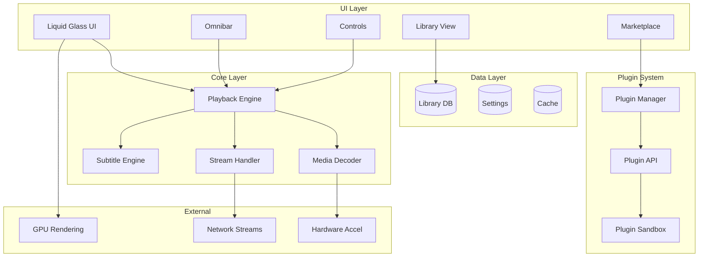
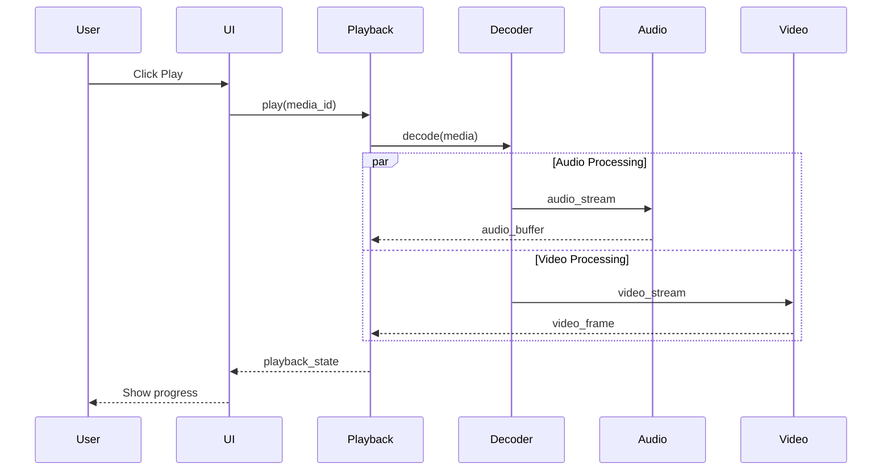
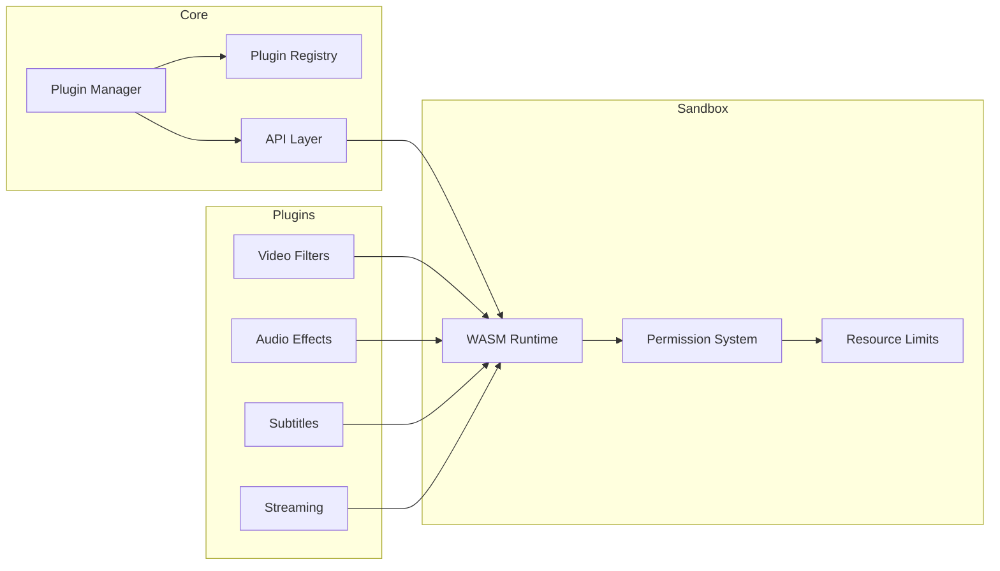
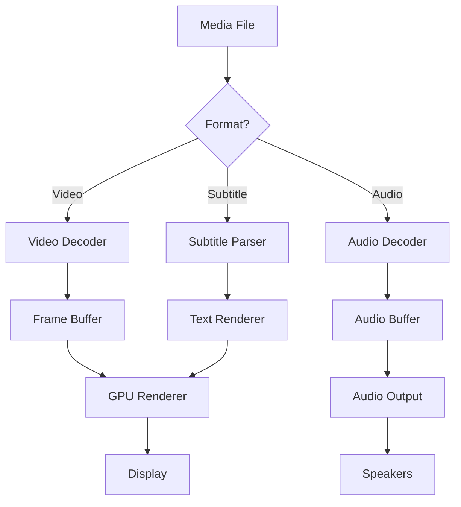
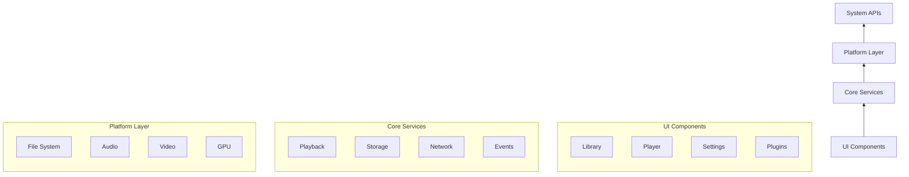

# Vantis Media Player - Architecture Diagrams

> **Visual documentation using Mermaid.js**

---

## System Architecture

## Playback Flow

## Plugin Architecture

## Data Flow

## Component Dependencies

---

## How to View

These diagrams render natively in:
- GitHub Markdown
- VS Code (with Mermaid extension)
- Docusaurus
- Notion

---

*Generated with ❤️ by Vantis Team*